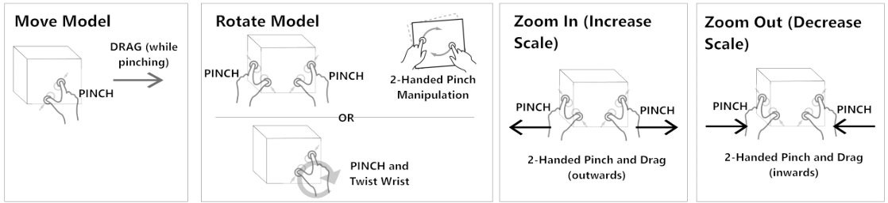

# User Guide

## Installing On The Meta Quest Headset

### Release Channel (recommended)

- This application has been deployed onto a private release channel on the [Meta Store](https://www.meta.com/en-gb/experiences/).
  - If deployed publicly, then searching the application in the store would be a way to install it. 
- To get this application onto a Meta headset the same way as you would with other apps, you must be added to the private release channel.
  - To be added, contact the owners of the application. 
  - Once added, the application will automatically appear in your applications ready for install.
  - Deployment means developers can push updates, and users will see these available.
  - This is the recommended way as in order for **Spatial Data** to be shared across headsets, Meta currently requires the application to be on
    a release channel (private or public), and only the added users are allowed to share Spatial Data (if public then anyone with the app can).
      - If your Meta account associated with the headset is not allow-listed onto the release channel, then Spatial Data will not be able to be shared,
        thus objects will not be in the same positions for users in the same room.
      - You can read more about sharing Spatial Data and Anchors [here](https://developers.meta.com/horizon/documentation/unity/unity-shared-spatial-anchors/)
      - You can read more about deploying your application to a release channel [here](https://developers.meta.com/horizon/resources/publish-submit)

### Android Application Package (.apk)

- Follow the installation steps outlined in the [Development Guide](./Development%20Guide.md)

## Starting The Application

- Launch the application from the Meta Quest 3.
  - Accept "Allow Spatial Data Usage" when prompt.
- When the application launches it will establish a multiplayer session.
- Once the session is established, the spatial anchor will appear on the floor and the model will come into view.
- From here other users can join the session by launching the application on their device.
- Controllers are not supported, only hand tracking is supported.

## Operating The Menu

  
Demonstration (click to expand)

  

    
  

### Opening The Menu

- Face your left palm towards you and pinch your index finger and thumb together when the icon appears between them (like you are squeezing the icon).
- Repeat the same gesture to close the menu.
- The menu will appear in the direction you are facing.
- User's cannot see other user's menus, only their own.

### Interacting With The Menu

- The buttons in the menu can be pressed either with your index finger, or the ray interactor by pointing at the button and pinching with your index finger and thumb together.
- The menu can be grabbed and moved around by grabbing the sides of the menu.

## Interactions

  
Demonstration

  

    
  

### Translating/Rotating The Model

- Pinch the model with either hand to grab it.
- While pinching, you can physically move the model to change its position, or rotate it as needed.

### Resizing The Model

- Pinch the model with both hands.
- To enlarge the model, move your hands apart.
- To minimize the model, bring your hands closer together.

## Exploding The Model

  
Demonstration

  

    
  

- Use the '**Explosion Slider**' to explode the model.
- Sliding the bar to the right will gradually separate the parts of the model for detailed inspection.

## Interacting With Individual Parts

  
Demonstration

  

    
  

### Enabling/Disabling Individual Parts

- Toggle the '**Individual Parts**' button on the left-hand side.
- You can translate, rotate, and resize the part in the same way as you would the entire model.

### Interaction Methods

- **Physical Interaction**: Touch items directly with an extended finger.
- **Ray Interactor**: Use a pinch gesture to interact from a distance.

### Enabling/Disabling The Ray Interactor

- The default interaction method is physical interaction.
- To toggle on the ray interactor select the '**Ray Interactor**' button in the center of the menu.
- Parts can now be interacted with from a distance.
- Note physical will stil be enabled, as such you can use both methods simultaneously, but they may interfere with each other.

## Switching Between Models

- In the '**Select Model**' list on the upper right-hand side, choose the model you want to view by pressing on its name.
- The selected model will be highlighted in blue.

## Selecting Refined Parts

- With the desired model selected, open the menu.
- Toggle the '**Refined Parts**' button on the bottom right-hand corner of the menu.
- The '**Select Model**' list will now update to show refined parts for the selected model.
- Select a refined part from the list.
  - The selected part will highlight in blue and replace the model on display.
- You can now manipulate the refined part the same way you manipulate the full model.
- To return back to the original model
  - Click the refined you selected again to deselect it.
  - Or toggle the '**Refined Parts**' button off and select a model from the '**Select Model**' list.

## Multiplayer

- A session will automatically be connected to when the application is launched.
- It is best to wait for all users to join before interacting with the models.
- When the session is joined the spatial anchor will appear in the same location for all users on the floor. Refer to [Sharing Spatial Data & Multiplayer](../README.md#sharing-spatial-data--multiplayer) to ensure this is setup to work correctly. 

Spatial Anchor
</img>

- Interacting with models works with a state authority system.
  - The user who interacts with the model will have state authoirty over it.
  - Other users can interact with the model and gain state authoirty.
  - There are cases where the state authority cannot be passed, if the state authority needs to be passed, reset the model and toggle off all features to allow another user to interact with the model.
- If the anchor is unable to be shared, the models can still be interacted with, but they will not appear in the same location.

## Known Issues

- **Model interactions not working or weird behaviour when interacting on load**
  - This issue was observed in earlier versions of the application and may have been resolved.
  - The issue arises when a model is interacted with before a multiplayer session is established.
  - To resolve this issue, restart the application and wait for the multiplayer session to be established before interacting with the models.
- **Models disappering the interacted with**
  - If a model disppears when interacted with and cannot be selected again, all users must restart the application to put the application back into a stable state.
  - The cause of this issue is unnkown, but is caused from the networking framework and its interaction the Meta Interaction SDK.
  - To avoid this issue, the user the starts the session should go through each model and interact with them before other users join the session.
- **State authoirty not being passed as expected**
  - If a user is unable to gain state authority to interact, simply reset the model and toggle off all features to allow another user to interact with the model.
  - This issue is caused by the networking framework and its interaction with the Meta Interaction SDK refusing to pass state authority.
- **Laggy/delayed interactions in multiplayer**
  - The application must connect to a server.
  - This server is hosted for free and may not have the best performance.
  - The server that is connected to is automatically determined and may have high ping, causing laggy interactions.
- If any other issues are encountered, please restart the application on all devices to reset the session and try again.
