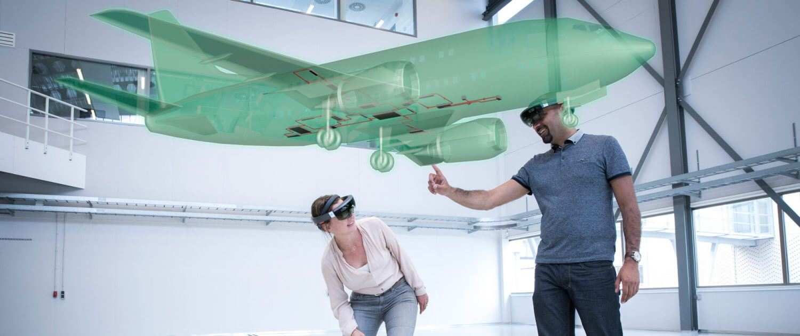

# Mixed-Reality Aircraft Operational Briefing Tool

## About The Project

The Aircraft Operational Briefing Tool project involved developing a Proof-of-Concept (POC) Mixed Reality (MR) prototype for
[CAE Australia](https://www.cae.com/defense-security/regional-operations/cae-australia/). CAE is a high-tech company known
for developing and delivering training and operational support solutions to global defence and security customers. They have
achieved several achievements through their training systems and simulation hardware and now aims to introduce mixed reality
for aircraft maintenance operations, briefing and training solution.

The MR Prototype will be used by technicians and trainees as a supplementary tool for aircraft maintenance operations and
support for maintenance briefings and trainings. Its development is strongly aligned with their mission and vision, as its
introduction would revolutionise their current maintenance and training technology with a digitally immersive solution through
interactive AR elements.

## Technologies Used

- [**Unity**](https://unity.com/)
- [**Meta XR SDKs**](https://assetstore.unity.com/publishers/25353)
- [**Photon Fusion**](https://www.photonengine.com/fusion)

## Getting Started

### Supported Devices

- [**Meta Quest 3**](https://www.meta.com/au/quest/quest-3/)
- Future devices are most likely to be supported as well, but this project was developed exclusivley using the **Meta Quest 3**.

### Sharing Spatial Data & Multiplayer

A **network connection** is ***required*** to use this application.

The application makes use of **Shared Spatial Anchors** to share *spatial data* between devices in the same room. You can read more
on Spatial Anchors [here](https://developers.meta.com/horizon/documentation/unity/unity-spatial-anchors-overview/). This feature
utilises the spatial data and anchors stored on the device locally, and through a networking framework (Fusion for this project),
this data is able to be shared across devices. This allows for virtual objects to be placed in the same location in the real world.

For this feature to work, the device setting **Share Point Cloud Data** must be enabled in the **Meta Quest 3** settings. This
setting can be found in **Settings > Privacy and Saftey > Device Permissons > Share Point Cloud Data/Enhanced Spatial Services**.

If this setting is not enabled or the application fails to share a spatial anchor (this may happen for a variety of reasons, such as users
not being in the same room) an error message will be displayed on the screen, and virtual objects will not be placed in the correct location.
The virtual objects will still be visible and can be interacted with by the users, as such the application will function if users are not
in the same space or the anchor sharing fails, baring that a connection to the server is correctly established.

### Installation

- To install this project directly on a **Meta Quest 3**, follow the [***User Guide***](./Documentation/User%20Guide.md)
- To install and test this project in **Unity**, follow the [***Development Guide***](./Documentation/Development%20Guide.md)

## Demonstration

  
Click to expand

  

    
  

https://github.com/user-attachments/assets/66bcf11b-3d39-48a4-84eb-5827a757f53e

